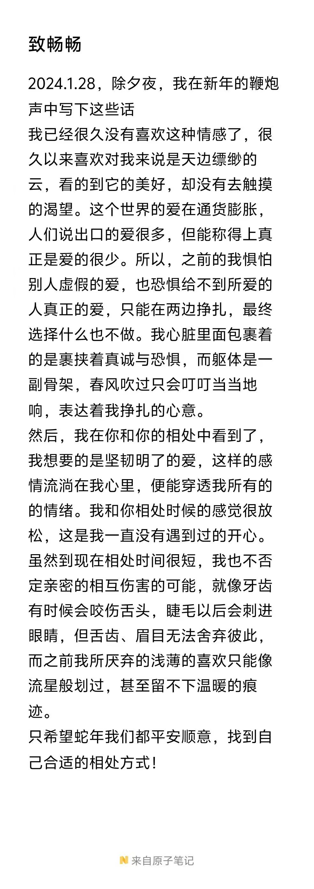

# 从《李银河说爱情》看和小桃的关系
## 契机
- 这段时间在图书馆做志愿者，昨天突然就想着去找两本书来看看，随便看了一下书架，突然，就看到了《李银河说爱情》一书，因为我上个暑假在成均苑中西书店看过她的另一本书《一生所寻不过爱与自由》，当时还特别喜欢这本书，我甚至把微信签名设置为了这句话，19岁总结的标题也是这个；反正就觉得和这个老师还挺有缘分的，因为我其实不太记得她的名字，但是看到书名我就突然✨，然后就开始看这本书。
- 最近这段时间也是一直在纠结一些和感情有关的问题，因为之前一直不知道怎么究竟该怎么处理这段关系，我也有很多的问题和顾虑，包括像：

        如果注定要分开为什么一开始要在一起？
        如何处理自己始终不安的情绪以及不配得的自卑？
        如何看待婚前性行为以及怎么处理和对方的相处交往程度？
因为很珍惜这次难得的相遇所以觉得还是要好好处理这些问题，做好自己在思想上的准备，以取得最好的结果。

- 当然，会看书肯定还是因为我是一个文艺女青年👉👈……我最近好像不是很喜欢看小说了，每次读完小说总感觉虚幻的故事对我来说没什么具体的价值，没有那么直观的收获与成长，所以内心一直很希望能多看一些社科和哲学方面的书籍，但是一般的这类书籍会很难读，比较晦涩看起来也很容易困和分神；好在这次看到的这本书非常好的符合我的需求，一是因为非常符合我对于感情学习的需求，二是因为这本书本就是为喜马拉雅听书而写的，所以语言非常的通俗易懂，非常适合我这种人，喜欢装但是又很菜。🥹

## 个人思想的进步
    主要是解决了我个人的很多疑惑，也给了我面对爱情和亲密关系的勇气

- **如果注定要分开为什么一开始要在一起？**
          - 老师谈到说，“这是典型的因噎废食”，不要因为害怕分手就不去恋爱，万一分手这种事情发生了再去勇敢地面对，这样的处理方式好过“因为害怕将来出现这种事而根本没有尝试和享受到这段感情”。这也给了我勇气，让我坚定了和小桃在一起的想法。
          - 因为爸妈一直对我很好，我不想像我哥一样偷偷谈不敢说欺骗他们，毕竟他们总是会为我考虑。之前和妈妈主动谈到过小桃，就说我可能要有对象了先知会她一声。我妈妈也很支持我，说“想谈就谈，没必要藏着掖着怕我们知道，不过你不要把感情看得太重，即使分手了也很正常，没得必要很难过，不要像有些小姑娘分手了还要跳楼这种完全没有必要。”妈妈的观点其实和老师谈到的有异曲同工之处，**不要害怕开始，也要勇敢面对分离**。

        谈到这，不妨说一下我爸妈对这件事情的知情程度。

        我爸不知道这件事情，我倒是没有不愿意讲，主要是我妈不让我讲，她说“只要你给你爸说了，你们以后每次开视频他就要问这件事情，烦得很，你谈你的，反正又没结婚，懒得和他说”。听我妈的话我就没说。之前爸爸很反对哥哥谈恋爱，但是对我倒是多了支持，之前他还主动和我谈到谈恋爱这件事情，对话如下：
         爸：你以后一定不要找太远的，刚开始的时候就问清楚是哪里的人，远了就不要开始，谈得感情太深了再分开就不好整了。
         我：为什么？
         爸：因为你嫁得太远了，如果有人欺负你，爸爸我就帮不上忙，所以找个近得点的，我就可以帮你撑腰。
        刚开始还觉得爸爸思想好不先进，还搞“只能找省内人”这一套，听完只觉得他只是想保护我，想我能够过得更好。

        我妈倒是知道不少情况，但我也就只是简简回复，不想太多透露我和小桃两人的具体交往。我妈妈知道我之前刻的印是给他的，还问我“长得如何”，这下我可来劲了，只管可劲夸！！！给妈妈看了小桃的照片（之前在pyq扒的几张照片，谁让他从没和我发过照片，搞得我好猥琐地去翻pyq然后点保存，偷窥.jpg）我妈说：“长得挺好看的，你就看他的五官呀什么的都很周正，可以！”听我妈夸他我也很开心，因为，他是我对象，不仅长得好看性格也好，最重要的是我们很玩得来，聊得来（至少目前是这样的）。

        我哥还不知道这件事情，等我和小桃正式谈了再和哥哥讲。

- **如何处理自己始终不安的情绪以及不配得的自卑？**
          - 关于这一点，我的感受和98上面一位同学说的很像：
  ！[alt text](98截图.jpg)

   李老师给出的回答是这样的：*我认为你的问题是病态自尊，太看重别人对自己的看法，太计较二人关系中的对等，如果自己付出的多，对方付出的少，就觉得自己的自尊心受到了伤害。解决的办法是要**加强自己的独立性和自信心，因为病态自尊其实来自自卑**。要尽量用一种独立和自信的态度生活，相信自己有独立的价值，不必依赖他人对自己的评价和重视程度。*
    
  - 其实在和小桃沟通的过程中也有收获。之前那段时间我经常做噩梦，经常梦到挚爱的人抛弃自己，在梦里会很伤心，以至于哭着醒过来。我每次都会第一时间给他分享我的感受，其实也不是在暗示些什么，只是觉得为什么他总是做甜甜的梦，而我每次都是苦涩。**后面他和我讲，他经常觉得是他给我的安全感不够，因为我父母对我很好，只可能是因为他才让我心里深处觉得没有安全感，才会反复做这种噩梦。**不过可能确实是因为是线上的原因，没有了线下的交往和接触很容易猜忌什么的，而且我们这段时间一直异地，从暧昧开始到现在也一直都是异地，所以可能存在猜忌什么的，等到回校之后情况应该会好很多。

        还是觉得小桃人很好，如此考虑我的感受，并且很厉害地分析出了原因，第一次听他说的时候我觉得好有道理，我都完全没往这个方向思考。
        他也有尽可能地去给我安全感，例如经常和我聊天，和我打电话，消息看到了也会认真回复，有在安排和期待我们未来的见面……
        关于性方面，“食色性也”；因为有见过那种欺骗女生，只是为了寻求性的快感的人，所以觉得能有人珍惜我，克制人生来就有的欲望，慢慢培养感情，这样子还是非常难得。

- **如何看待婚前性行为以及怎么处理和对方的相处交往程度？**
          - 之前的我确实“谈性色变”，首先是因为从小到大确实没怎么接触过正经的性教育，总觉得难以启齿，另外，我身处的性脚本就是这样一个保守的社会，守贞、克制欲望……但是看了老师的书之后，我觉得确实没必要如此，一是克制自己的性欲望，二是闭口不谈性。就像说“食色性也”，性其实和吃饭一样，都是人的正常需求。
          - 大一上思政老师问过一个小问题，就是能不能接受对象不是处女/男？我当时给出了坚定的回答，就是不介意。我觉得性确实是一定感情阶段的产物，我们也不清楚这一任会不会一直不会分手，但是在谈的时候确实觉得对方就是Mr.Right，所以发生性关系也无可厚非，只是说确实要做好安全措施，这一点很重要。
          - 交往到一定阶段再拥有性对我来说是可以接受的。这里先指出交往没多久就发生性关系的几个缺点：
                            - 激素支配，没有保证：我很坚定的认为有爱才有性，如果感情发展顺利，到了稳定阶段我才会知道自己的眼光有没有错，是不是遇到了真正爱的人，太快的性关系可能只是一时激素支配的结果，可能我并不是真的爱他，他也可能并不是真的爱我，我误以为我们有爱，但其实没有，所以，也不应该有性。
                            - 性欲不应该成为我们感情维系的纽带：没准就会遇到一个人，享受和我的性生活，而不是和我的生活，不是我这个人；最后也难免被对方哄得团团转，欺骗，抛弃。
                            - 对方的性欲>爱情：从理性条件来思考，我们肯定会觉得真正的爱情应该等感情稳定，等双方熟络之后再发生性关系，这也是培养感情的必经之路和有效的促进方法，如果对方只是一味的性暗示，总会给人追求性>追求爱的错觉。为了长长久久的爱情，在初期的性欲还是应当适当克制。
          - 性其实是人类的正常需求，之前的我其实也渴望性，但总会觉得自己的想法很可恶，所以会避免讨论。后来觉得，其实没必要克制自己，勇敢地追求，勇敢地享受，这也是对自己的嘉奖和认真积极的生活态度。看书之前，我总是处于一种很矛盾的状态，内心渴望但是又觉得不应该渴望。李老师的书确实给了我很多新的知识以及面对性爱的勇气，跟随自己的内心，顺其自然，不刻意追求也不抗拒，随遇而安。

        因为看书的时候一直有和小桃分享一些书中的看法，所以也有聊过关于性的这个话题，这也算是我第一次正经的和别人聊性，他还在感慨我居然是一张白纸，非常干净，对于性以及人类生理了解如此至少，当然在交谈当中我也学到了很多。
        最后我们也达成共识，虽然性欲一直存在，但是为了长久的感情来看，我们也会克制本来的人性欲望，等到感情发展到一定阶段再来考虑这件事情。
        还是夸夸小桃，因为他能做到为我考虑，为我们的关系考虑，也很坦诚地和我表达自己的感受和看法；在我被情感支配，无法理性的时候，还是需要他来把握大局。
## 谈谈最近的感情进展和感悟
    你说人们为什么分离？
    你说不应该忘记
    你说这人间喜剧

    你会不会遗憾没有结局？
    我想我会把拥有的丢弃
    只为了，越过人海，拥抱你
- 别人的爱情
          - 经常看到大家的爱情故事，看到大家因为各种各样的原因分离，总是无法不去把我和小桃带入，我会庆幸我们的遇见以及双方对待感情的态度都非常好，我会庆幸我们将不会重蹈他们的覆辙，但是，我会担心，会不会大家在一段感情的开始都会很坚定的认为自己将是不会分开的那一对，到头来却因为现实的困难而放弃，会不会我们也将分开？
          - 每次开始有这样矛盾的心理时，小桃和我对待感情的态度总会给我莫大的勇气。我知道我们双方都很重视感情，我们都不是因为渴望恋爱而随意开启一段关系，我们聊得来也能玩到一起，我们有对彼此的生理性喜欢，我们都很好沟通，我们情绪都很稳定……我觉得，我们有这么多优点，我们有更大的概率去成功面对未来的挑战。即使现在说话的我可能有受到恋爱初期激素支配的影响，但我仍坚定地如此认为。
- 我们的故事
          - 最近每天都会打电话，也成了我这几天最期待的事情，我很享受和他无话不聊，很享受情话带来的快乐，很享受和他一起规划未来……小桃曾说，“我也不否定亲密的相互伤害的可能”，确实，未来未来，我们都不知道我们是否一定能走到最后，但是我们都还是很有信心的，毕竟我们并不是随随便便在一起的。
  
          - 之前聊到我们各自之前对待恋爱的态度，发现竟然非常相像，就是不会刻意去追求，觉得自己一个人过得也不错，更多的是静静等待爱情的到来。确实从我和小桃的交往中来看，我们都是因为是TA，才愿意踏进一段亲密关系，而不是因为想谈恋爱就谈了（感觉说得太早了，目前还没有谈）。
          - 除了以上这些，我们平常还有很多相处聊天的小细节。例如今天我穿鞋非常磨脚，把我脚后跟磨破了，我就和他抱怨，还说“要是你现在在我旁边，我就开玩笑让你背我”，他就说“要是我真在我真就背你了”。这不禁让我想到了我和他表达爱的方式，不会藏着不说，而是大胆表露，不会惧怕他人的目光，只关注当下的我们。
          - 当然，我有时也还会担心我们目前的甜蜜会不会只是恋爱初期激素作用的结果？会不会到了之后就不再喜欢？会不会我们也会和大多数本科情侣一样毕业即分手？我不知道怎么回答这个问题，但是我希望不是的，因为在茫茫人海中遇到对方真的很不容易，我们也都觉得对方很好。有时候我也在怀疑自己当初的人生规划是不是有妥协的余地，就是说我当初下定决心要出国读书，现在的我觉得为了小桃，为了我们共同的未来放弃出国这个规划也未尝不可；当然这只是我目前的想法，真正怎么做还得等到我必须做决定时我们的感情情况。
          - 补充：写完文稿的当晚和他聊到了这个问题，关于我们的未来，我问他有没有往长远考虑过我们的感情，具体到了哪些阶段？他说有，就例如，换校区了怎么办，要是他还没毕业我毕业了怎么办？我也有很坦诚地告诉他我未来的规划，其实在浙大读研也未尝不可。另外的话我们还有聊到关于我们会不会像其它情侣一样初期甜蜜最后分手？我们双方给出的答案都是不会，小桃进行了认真的分析，就说我的性格很好，觉得能够和我在一起很难得；我也觉得很难得，所以还是希望能够和小桃一起走下去。
## 庆幸没有失之交臂
    这世界有那么多人
    多幸运“我”有个“我们”
感觉有很多因素都会阻止我们的相遇，所以我们能走到今天确实非常的幸运，希望以后也能共同面对生活中的喜怒哀乐，在相逢的路上携手前进。**爱迎万难，爱也赢万难。**
