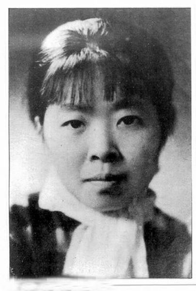

# A-litter-to-45
2024-04-20 农历三月十二

本来应该昨天写的，结果因为准备考试给搁置了，那就今天补上吧。

- Ⅰ
    - 之前从没给妈妈写过信，记得上一次是初中的时候，当时我妈来开家长会，老师把我们写给父母的信发给了家长们，我们班最调皮的那个男生（向林欣）和他妈妈感动得稀里哗啦的，我和我妈站在那人群里显得格格不入，大家都是很感动，只有我们俩站在那儿笑（🤣，什么原因，因为我就写了一两段，还是敷衍着写的。后来还写过一次，是高三开家长会的时候，老师让我们给家长写信，不过这次是我爸来的，当然，我也没写些什么很肉麻的话，可能我们家得家庭文化使然。
    - 印象中我妈就没怎么变过，从我哥1岁照片开始她就一直都是那样，实话实说，我妈确实很漂亮。记得，我和我哥暑假看到爸妈年轻时候的照片，觉得，咱俩都没他们俩年轻的时候好看，开玩笑的说他俩就不适合生孩子（。之前在kindle上看到了一张萧红的照片，那张照片是真的像我妈，我妈自己看了都说像。
    
- Ⅱ
    - 后面有空了再补吧