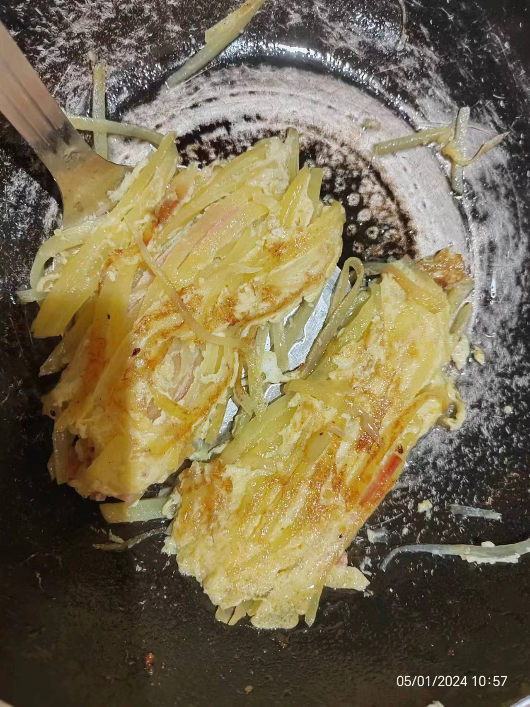
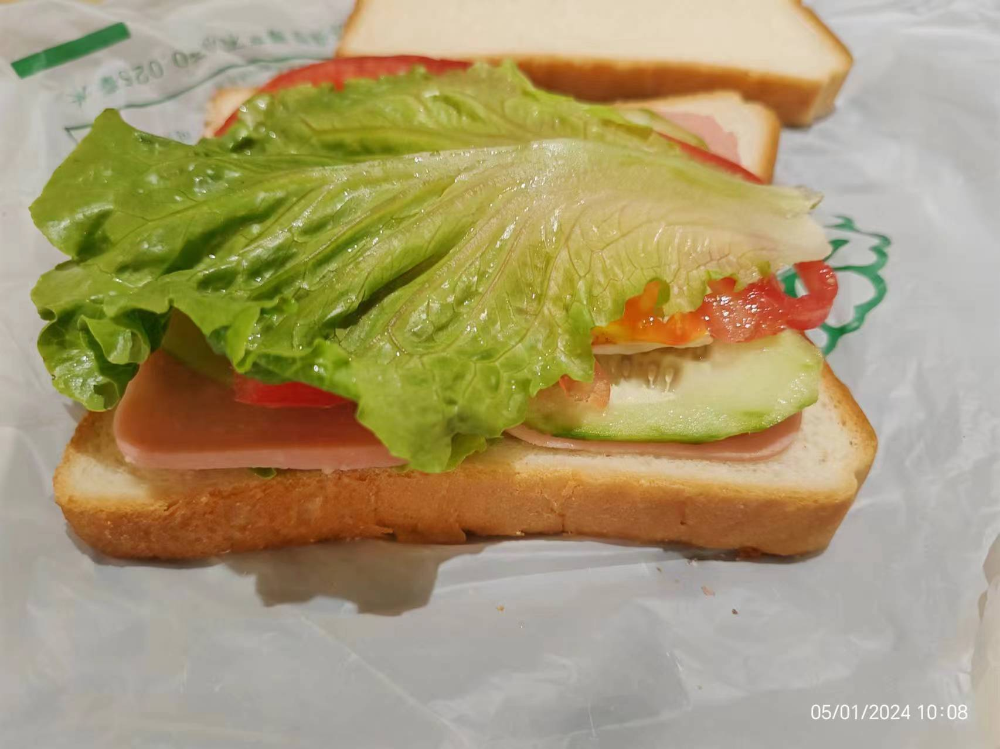
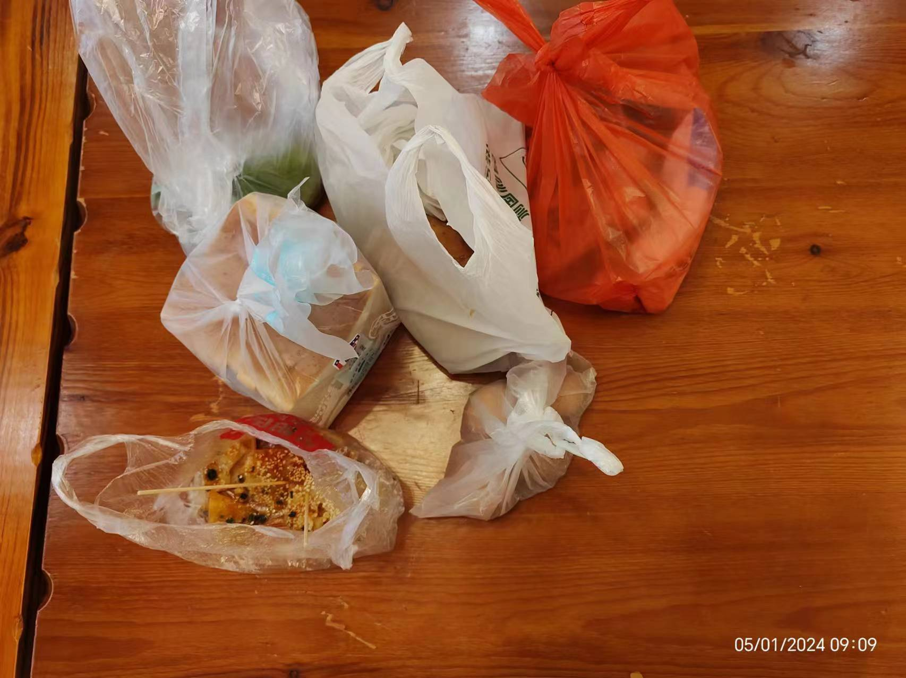
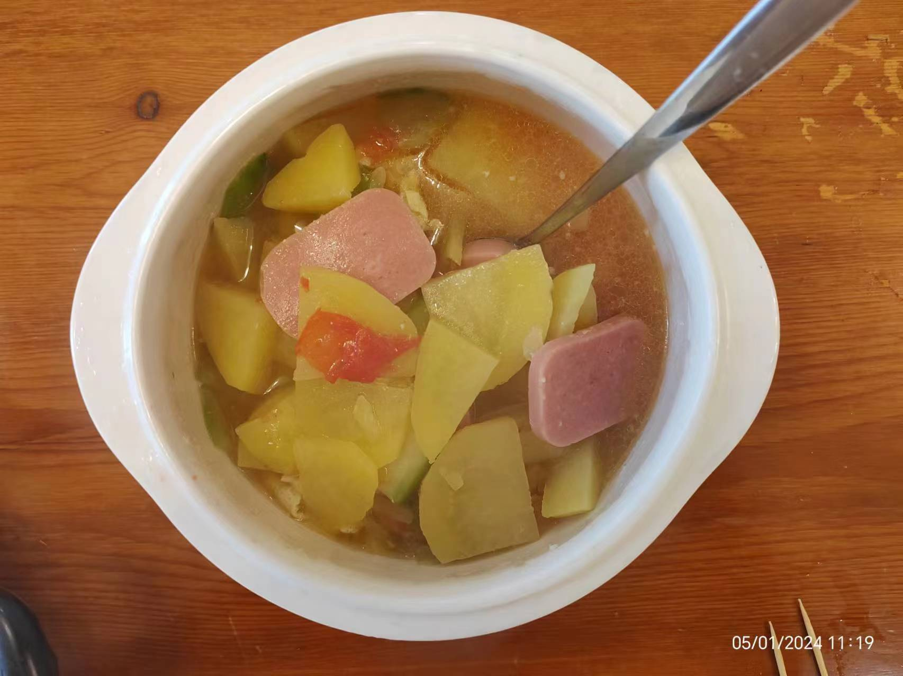

# 夏天的梦是什么颜色的呢✨

- Ⅰ：去年那个夏天
    - 我还记得，去年的五一节，我坐在教室靠阳台的那一组，靠过道。五一节，大多同学都出去玩了，我和冉冉点了一份凉皮，一个肉夹馍，一份蜜雪的冰淇淋。外卖的袋子里面有好多的冰，我和冉冉带着凉皮到了乒乓球台那边，坐在凉椅上，我记得那份凉皮很好吃，真的很好吃，也是真的很开心。
    - 那是高考前三周，某一个周五，看着楼下小学生放周五假，我想飞出去的心在那一段时间里达到巅峰，记得蒋承志说：没事，我们还有两周就有双休了。确实，我记得，同一个位置，那是一个周末，我在中午听了会儿mp3，听到一首歌——漠河舞厅——当时我特别喜欢这首歌，想着一定要记下他的歌词，一时没有找到很好的载体，我随手拿起一个教室里面的口罩，在纸质上抄写了歌词，当时，我透过避光的黄色玻璃，看着窗外的天空，想着，还有三周，我就可以毕业了。
    - 高三经历了许多，不仅有大大小小的考试，还有很多青春的回忆。有我暗恋别人从开始到结束；有我真真切切地交到了好朋友。因为暗恋，我怀疑自己的价值，耽误了三月的学习，但也是因为暗恋，我和蓝意淋，llt成为了好朋友。明德楼的乒乓球台旁，我和蓝意淋在那里一起和过好几次酒，就是很普通的鸡尾酒，反正我喝完一点醉意都没有，我们一起聊天，聊暗恋对象，虽然最后我们都失败了🤣
    - 昨晚还想起了三月的某个夜晚，我约wjy走路回家。出发前，我去了趟厕所，上完还在厕所镜子前整理了一下着装，llt和蓝意淋在走廊看到了。正式出发，我和wjy走在前，他们跟在我们的身后，说看着我们很搭，我都不知道他们跟着我们的。我和他从明德楼出发，走到了至善楼混着高一高二的人群又走回了寝室楼下，再是分别。可以说，这是我高三那段时间和他最近的一次，也就只有这一次，我们说了很多话。因为大多数时间，我们说的话就是高三普通同学应该说的话，也就是不说话，要说话也就那么一两句客套话。虽然最后是遗憾，但还是很感谢这段经历，一是青春更加精彩了，二是和llt，lyl关系更好了，我们三人发誓一定要考过对方的话也算是一种激励吧。
- Ⅱ：今年这个夏天
    - 昨天，我一个人早起骑车去了农贸市场，买了番茄，黄瓜，生菜，火腿，鸡蛋等等，然后回到学校，在紫四毕至居做了早餐。
    -  .jpg>) .jpg>)   
    - 大一过得很快，就像高三混得一下就过去了一样。此刻的我，坐在自习教室里里面，写着自己想写的日记，依然可以看着窗外发呆，但是我却不是去年的那个我……生活不是单一的颜色，不是巴蜀紫，不是窗户黄，生活是[彩虹](http://163cn.tv/qD3uAT8)
- Ⅲ：[夏天的梦是什么颜色的呢](http://163cn.tv/qD3CFRf)
    - 和过去道别，和往事说再见。
    - 被你改变的那部分我，代替你永远和我站在一起。
    - 和你说再见，安好。你是别人，也是我自己。👧👩‍🦰👩‍🦳✨