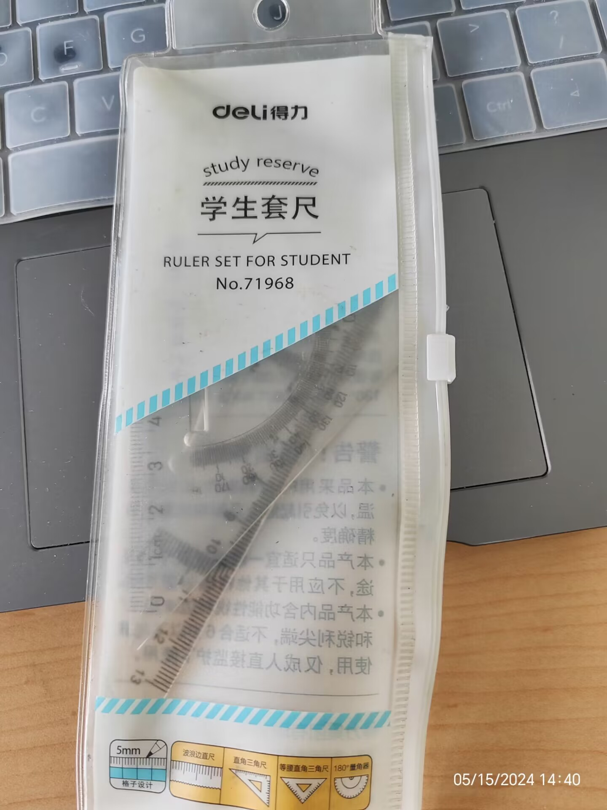

# 十万分之一的概率，我一直很幸运

## Ⅰ 命运使然
- 很多年前很喜欢一款套尺，那是一套得力的套尺，买过一次因为很好用，所以我又购入了一次。高中用过一段时间，但后来也就没用了，放了很多年，在大一下册因为要上工图课程，所以我又将它带来了。今天下午，我看到了套尺的编号，“No. 71968”，五个数字，正好构成了我身份证的后几位，想了想，十万分之一的概率构成这个数字，又有多少次我差点就将它给丢掉，看到它的概率也是很小的。我今天能看到这串数字，该是多么的幸运呢！是多么的难得呢！

   
- 很久之前看到过一段话，(刚刚查了一下，是席慕容的诗，《回眸》):

       《回眸》 席慕容

        前世，我频频回眸，

        挥别的手帕飘成一朵云。  
        
        多少相思， 多少离愁，  
        
        终成一道水痕送我远走。  
        
        今生，我寻觅前世失落的足迹。  
        
        跋山涉水，

        走进你的眼中
        
        前世的五百次回眸，
        
        换得今生的一次擦肩而过，
        
        我用一千次回眸，
        
        换得今生在你面前的驻足停留。
        
        问佛：
        
        要多少次回眸，
        
        才能真正住进你的心中？
        
        佛无语，我只有频频回首。
        
        像飞蛾扑向火，
        
        可以不计后果，可以不要理由。
        
        回眸， 再回眸，
        
        千次万次，
        
        你在我眼中 ，也在我心中。
        
        我频频回顾着， 期待你的温柔。
        
        我频频回顾着， 渴望长厢斯守。
        
        前世， 我在舟中回眸。
        
        莲叶一片一片，
        
        连成我眼中的哀愁。
        
        今生， 佛成全我的思念。
        
        让我走进你的眼中。
        
        我寻觅了很久， 累了。
        
        只想在你怀中停息，
        
        只想让你的手，
        
        揩去我脸上的泪痕，
        
        只想让你的体温温暖我冰凉的双手。
        
        不要问我为何，
        
        今生千里迢迢将你寻觅。
        
        我没有喝孟婆汤， 心中牵挂着你。
        
        不要问我为何哭泣，
        
        我没有喝孟婆汤 ，
        
        仍记得前世离别时心底的绝望。
        
        说我喜极而泣吧，
        
        泪落在你的襟上。
        
        前世的种种哀愁，
        
        开成一树繁密的丁香。
        
        我只想与你携手，
        
        在树下看那一朵开成五瓣向我们预言幸福。
        
        今生，我仍旧频频回望，
        
        今生，我仍旧不喝孟婆汤，
        
        来世我还会，
        
        千里迢迢将你寻觅。
        
        来世我还会，
        
        和你手牵手寻找五瓣的丁香。
 
    *前世的五百次回眸，
    换得今生的一次擦肩而过，
    我用一千次回眸，
    换得今生在你面前的驻足停留。*

    每个人的每个选择构成了这个世界，我们相遇的概率是可以计算又不可估量的，珍惜每一次相遇，每一次对话，每一次离别。相比起擦肩而过，相比起驻足停留，我们的相遇是多么的难得！我又是多么的幸运，能够遇到你们！

   > 真是感概于世界的奇妙，此时此刻，耳边正放着《彩虹》——

        啊 世界很大  
    
        有多少日夜独往  
        
        啊 旅途漫长  
        
        共一曲歌谣相伴  

- 偶尔经常想到身边的同学，长辈，老师……想到他们的和蔼友善，想到他们对我的帮助，想到他们用我希望对别人的方式对待我——啊，世界真是一个循环——正能量与快乐在传递。

    到高中时期我的同班同学经常帮助我，没有回报，没有义务，但一直坚持从不拒绝，我也知道没有他们就没有我，没有今天的一切，知道没有这些小概率的积累，一切都将不同，要是其它的选择，我的生活会变得更好吗？也许会，但也可能不会！

    > 突然想到大物老师讲的“概率事件”，大量无规律的偶然事件构成的整体是有规律性的。那么，我们这个世界是不是也是这样的？无数人的选择构成这个世界，如果我们确定一个生活快乐程度中值，一半的人的生活因为这些选择不及中值，一般的人超过中值。但是我们并不知道自己究竟是哪一类，但不可置疑的是，我们都可以在现有的生活当中做好后续的选择，发现生活中的美好，感受到生命的意义。

- 今天一丁妈妈给我买了一箱车厘子，我之前从来没有自己买过，一是自己对于水果并没有太大需求，二是确实太贵了，总觉得不太划算。后来一丁爸爸又说，*“王一丁到巴蜀读书最大的幸运就是遇到了你，我和你阿姨都不知道该怎么感谢你，有机会一定到巴中来耍！”*没想到我有一天也会成为别人最幸运的事的主角。

    对于自己行为的规范，我的原则是，传递正能量，让大家的生活因为我的存在而更加美好。~~看来我高中确实做到了泥🥰~~

## Ⅱ 明确方向，继续努力
- 主要是最近学习感觉不太认真，想着还是要做有用功，继续进步，继续努力。hhhhh，玩完~