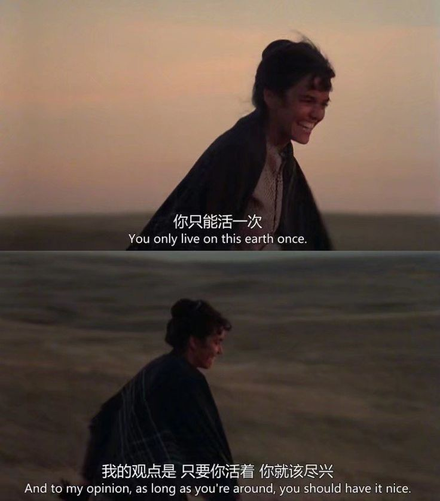
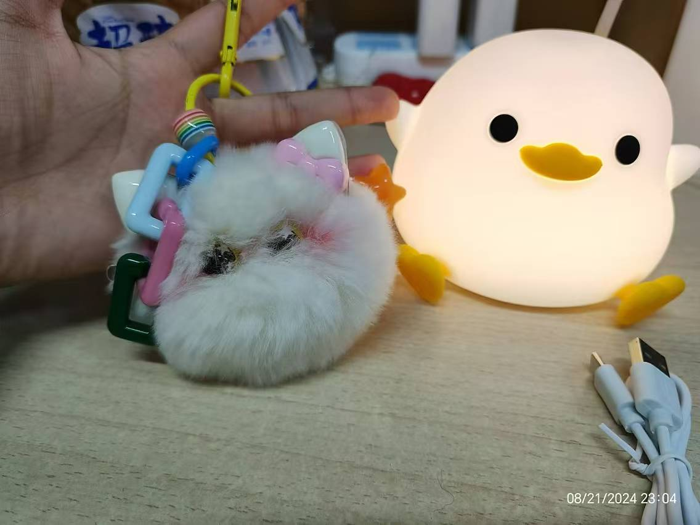

# **一生所寻 不过爱与自由**
    若是月亮还没来
    路灯也可照窗台
    照着白色的山茶花微微开

    若是晨风还没来
    晚风也可吹入怀
    吹着那一地树影温柔摇摆

## **寂静的凌晨十二点**
- 先祝畅畅生日快乐哈哈🎂
- 寂静的凌晨十二点，我掐着点走出了浴室，本以为会被祝福轰炸，但是却非常的寂静。没错，如果我不提起，还是没人会记得我的生日。
- 说不失望肯定是不可能的，想起来，凡是玩得稍好的同学，我都会认真的记录下他们的生日，卡着零点送上我的祝福，虽然一两句祝福显得无关紧要，但这至少代表我并没有忘记他。我一直觉得自己朋友还是不少的，玩得好的也还蛮多的，但是没有一个人想起来，这我还是有点小失望的🥹
## **无关紧要的18-年度总结**
### 第一次的人生

        和好朋友一起旅游
        出国访学旅游
        看了很多不同类型的书籍
        大学生活步入正轨
        更多的做自己
        自己挣钱实现经济独立
        ……
第一次十八岁，畅畅已经做得很不错了👍哈哈
### **实力与技能**
- 班团委
    - 主动竞选当了班上的班长，不论是领导力培养，还是与人沟通的能力，都取得了很大的进步。也要表扬畅畅在刚步入大学的迷茫中鼓起勇气去竞选了这个职位，确实印证了那句话，“机会是靠自己争取来的”。确实是一次非常有价值的历练。
    - 凭借这个机会，我确实培养了多方面的能力，包括宣传工具，立项能力，活动组织能力。当然，在这个过程中也认识了很多好朋友，这也为我后来提供了便利。当了班长，我才有了这么多优秀的班团骨干朋友，我才有了后来参加学长组的机会，才有了在面试中使用的优秀履历，才有了为数不多的奖项（园级优秀团干）。我也因此遇到了更多的人，拓展了人生的可能性，见到了更多更丰富的人生。
- 学习能力
    - 和高中如出一辙，我花了将近一学期（或一年？）的时间去适应新的学习生活和学习环境，过程中会遇到很多困难，表扬畅畅，没有放弃。
    - 这一年里，每每遇到困难和自我怀疑的时候，我总会试着原谅自己，原谅自己花了大量时间去做无用的事情，原谅自己刚开始的低效，原谅自己总是做不到自律。原谅自己应该被原谅的地方，当然，也总是会批判性的反思。
    - 学习能力上确实得到了很大的提升。除了一直都很差劲的数学，现在的我在学了c程，工图之后，越发的相信自己能够学好所有的未知课程。说来是多么的幸运。所以以后还是继续努力。

            看过ted的一个视频，说，做事成功的人知道怎么做是对的，
            但是，做事失败的人难以确切的知道怎么做是错的，因为变量太多了。

- 穿搭（算吗？）
    - 因为高中的时候基本没有关注过这件事情，刚上大一的我又有很多事情要去做，所以一直把这件事情搁置了。从上半年开始，我开始去寻找最适合自己的博主，找到了“六月小miumiu”，确实，无广，注重思路，而且和我一样高。非常好。通过这种注重思路而非买买买的穿搭思路，我确实提升了衣柜里衣服的利用率，而且整体感觉会比之前好一点。
    - 穿搭是需要一定经济基础的，尤其是像我这种高中基本没有衣服能用的情况。不过还好，新买的1700的衣服也够我用一阵子了。

## **一生所寻不过爱与自由**

### **规划**
- 之前有想过本科毕业之后申请国外的全奖phd，但是现在想来有点跟风了。没有考虑完全自己的能力，自己想要的生活。
- 李银河老师的书确实引发了自己的进一步思考，人生是幽灵岛，短暂的出现就又隐没。向死而生，*“我的观点是，人生只能活一次，要活就得活得尽兴。”*

        自由地去做自己喜欢的事情
        自由地去爱自己喜欢的人
        自由地选择自己喜欢的生活方式
        这就是我的人生宣言

- 以前觉得一定要成为一个优秀的人，但什么叫优秀？要绩点高，要履历精彩，要科研优秀……没有被定义的优秀确实我一直追求的目标。其实，做一个普通人也没什么不好。我可以有自己的职业，自己的家庭，小小的幸福也可以让生活充满光亮。还是那句话，人生就是幽灵岛，短暂的出现就又湮没。
### **生活态度**
- 相比起高中时期，自己已经有了很大的进步。我记得高中的时候，会把自己压迫到极致，那时的我并不觉得这很折磨，只会埋头努力，三年都是如此。上了大学之后，我对于自己多了一份随性，不再会责备自己没有利用时间好好学习，不会不给自己抽离的时间，不会push着向前。越发认识到人生的短暂以及自己想过的人生绝不是怎样的。
- 举几个例子，高三的时候，一学期我都没有买过新衣服，到后期，我的鞋子坏了我都没有换新的，不是买不起，而是不敢破坏一直以来的习惯和生活状态。不论是买新衣服还是出去疯玩，总会成为使我分心的因素，所以，我逼迫自己杜绝掉这一切可能的因素。另外的话，我晚饭时间会一个人多上一会儿自习，如果有同学找我聊了十多分钟天，我也会觉得很愧疚，觉得这十多分钟我本可以背几句名句，复习几十个单词……我习惯于把时间进行等价替换，总觉得每一分每一秒都不应该被浪费。虽然这样不太好，但也正是因为这样的行为，我才能在三年后考上浙大，来到浙里。

## **[道别是一件难事](https://music.163.com/#/song?id=1888933954)**

    和往事说再见
    可过去的影子
    又怎么能填埋清洁

    说是都忘记了吧
    其实比谁的要记得
    那个场所那个刘海那个雨天

### **和过去说一声谢谢**
- 感谢那些没有忘了我生日的人，感谢那些偷偷给我买礼物的人，一句简短的问候已经足够。（点名感谢lyl和mtgg）
- 感谢在过去一年中帮助过我的同学，学长，老师和我亲爱的家人，有你们，我才能走到这里。
- 感谢生活的美好，苦难与挫折，感谢这些将我磨砺成人。
- 感谢畅畅一直保持乐观向上的态度，不论是学习还是生活，都没有失去意义。

### **挥挥手，再向前**
  
    
    若真忘一个人              有时在午夜间
    又怎么会允许他在心里       在人群里
    荡着秋千                 在马路旁

    若真爱一个人              有时在空气中
    嘴巴上的咒骂              在酒杯里
    都成了思念的烟            在热澡堂

    和故乡去道别              什么是纪念
    鸟儿在森林间              什么是纪念
    它们要去来时地方           纪念无需记得
                            是心在偷偷下雪
    和往事说再见              故乡哟故乡 爱人哟爱人
    可往事总会有它的脾气       既然都忘不掉
    不慌不忙                 不如就装着吧

- 哥哥的祝福：*“生日快乐!身体健康和过得开心最重要。过去的日子做得都很好，希望你继续坚定的追逐你的梦想，实现一个一个目标，距离自己理想中的人生更进一步。除了你自己，不需要让任何其他人满意。乘风破浪，野蛮生长。“我的观点是，人生只能活一次，要活就得活得尽兴。””* 小时候老是和哥哥吵架，但愈长大愈是依赖他，在哥哥面前我始终是一个小女孩，哥哥会给我买可爱的猫猫钥匙扣，会给我找各种资源，帮我解决各种问题。🥹

- 自己的期望
    - 好好学习：无论到了什么时候，学习永远是第一顺位
    - 勇敢做自己：继续保持现在的状态，热爱生活，向自己想成为的模样奋进
    - 平衡：学习和生活的平衡吧，可以多多的体验生活，多去看看这个世界
    - 看书：不论是什么类型的书籍，只要感兴趣都可以多看看，相信它存在的价值
    - ……