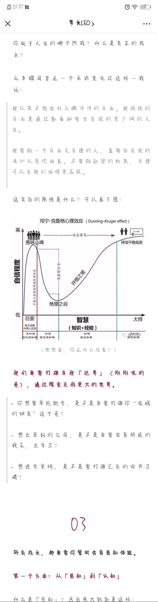

# 苏格拉底的申辩

- Ⅰ 阅读契机&读前先知
    - 今天早上，一丁爸爸给我推荐了这本书，晚上看了会儿大物之后觉得不想看了，就下载了这本书开始阅读。我知道这是本哲学类的书籍，之前看《精英的傲慢》和《工作、消费主义和新穷人》这类社会类书籍都没看下去，觉得太过于晦涩难懂，看它之前特地去了解了一下究竟有多长，发现其实挺短的就坚持读了下来。
    - 对于这类书籍要是长了我是不会看的，一是读起来阅读体验不佳，心情不会特别的舒畅，二是理解不到位，花了时间还没学到东西，会觉得不值。这次这本综合下来还好，篇幅不算长，内容没有那么不易理解（虽然我差点看睡着两次
    - 关于苏格拉底，我只是知道有这个人，知道是位非常伟大的哲学家，但相关的著作和核心思想我从来没有了解过。看完全书之后，我还去看了一篇书评，算是有一些新的体悟。了解了他的“无知之知”之后，我想起来高一未开学的时候我看过一幅图!!当时在高一物理课上张绍兵也说过“我不知道我不知道”——果然“人生是个轮回”。
- Ⅱ
    - 先说说苏格拉底本身的故事：他是一位伟大的哲学家，但是他的一生并没有留下什么著作，他的哲学故事都是由他的学生们整理著成的（还有很大的可能是假装的。他被认为是世界上最智慧的人，受了神的神谕，但是他自己并不认为自己很智慧，所以他开始探索自己的无知，但是在他与别人的交谈过程中，他不断的指出别人的物无知之处，他发现，或许自己确实比别人要智慧，他认为每个人都应该认识到自己的无知，而不是假装知道那些自己本来不了解的东西。
    - 认识到自己的无知，而不是只看到自己已经知道的东西。正如，人的最高境界就是不知道自己知道。
- Ⅲ
    - 当然，因为第一次看很多背景都不知道，所以读下来感悟并不多，之后一定会再读一次。